# Linux System Toolkit

A professional Bash-based Linux administration and networking toolkit designed for system monitoring, service management, security auditing, and troubleshooting.

---

# Features

- System information monitoring
- Memory and disk usage analysis
- Network diagnostics
- Open port detection
- Internet connectivity testing
- NGINX service monitoring
- SSH service checks
- Firewall status monitoring
- Failed login detection
- World-writable file detection
- Interactive terminal menu
- Colored terminal output
- Log generation support
- Port Scanning
- Host discovery
- Security auditing
- Log analysis and monitoring
- Service Monitoring
- NGINX Port Check
- SSH Port Check
---

# Technologies Used

- Bash Scripting
- Linux
- Networking Tools
- Nmap
- Systemd
- Git & GitHub

---

# Project Structure

```bash
linux-system-toolkit/
├── toolkit.sh
├── scripts/
│   ├── system_info.sh
│   ├── network_info.sh
│   ├── service_check.sh
│   ├── security_check.sh
│   ├── log_monitor.sh
│   └── network_scan.sh
├── screenshots/
├── logs/
└── README.md
```

---

# Installation

Clone the repository:

```bash
git clone https://github.com/YOUR_USERNAME/linux-system-toolkit.git
```

Go into project directory:

```bash
cd linux-system-toolkit
```

Make scripts executable:

```bash
chmod +x toolkit.sh
chmod +x scripts/*.sh
```

Run the toolkit:

```bash
./toolkit.sh
```

---

# Usage Example

## Main Menu

```text
==============================
 Linux System Toolkit
==============================

1. System Information
2. Network Information
3. Service Status
4. Security Checks
5. Exit
```

---

# Screenshots

## Main Menu


## System Information


## Network Information


## Service Status


## Security Check
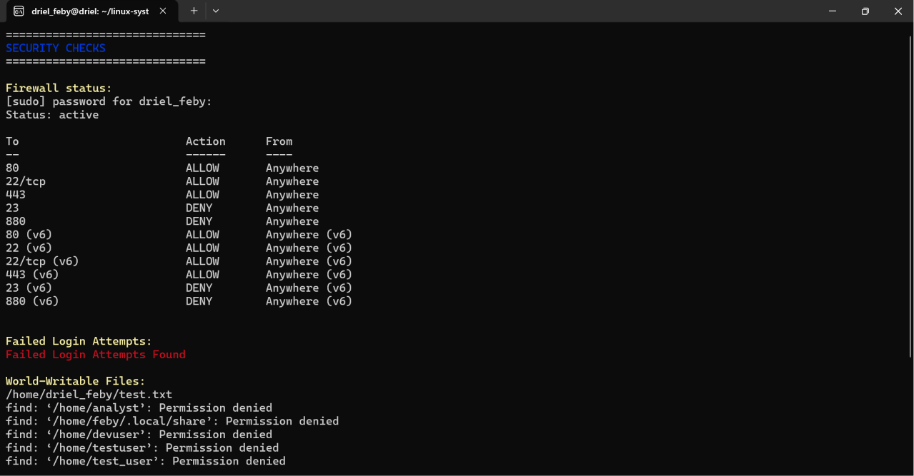

----------
# Service Monitoring

## NGINX Port Check

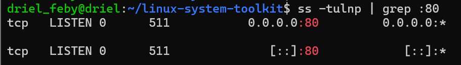

---

## SSH Port Check
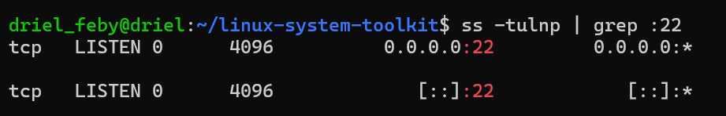

-------

# Log Analysis & Security Monitoring

## SSH Logs

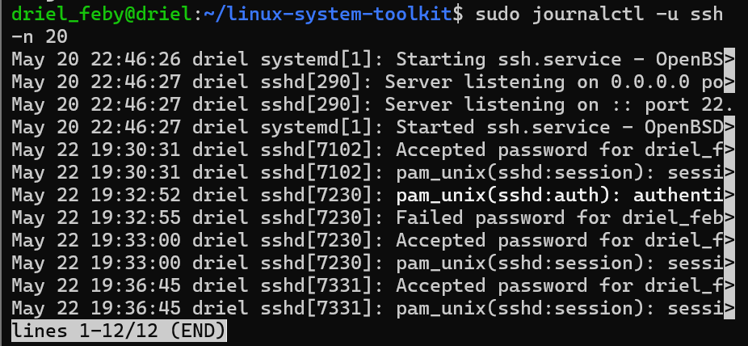

---

## Authentication Logs

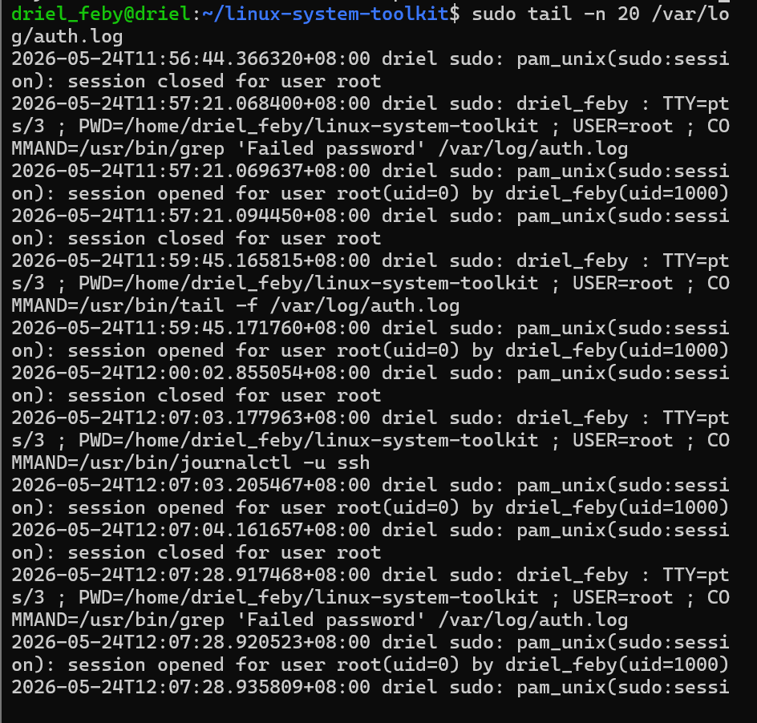

---

## Failed Login Detection

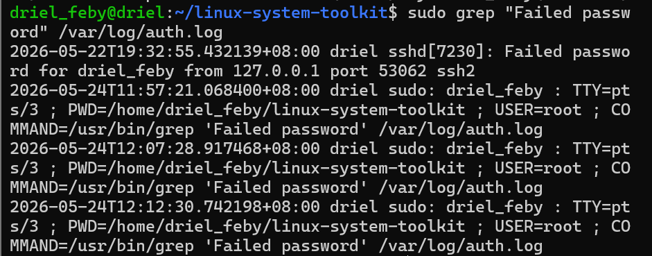

---

## Log Monitoring Script

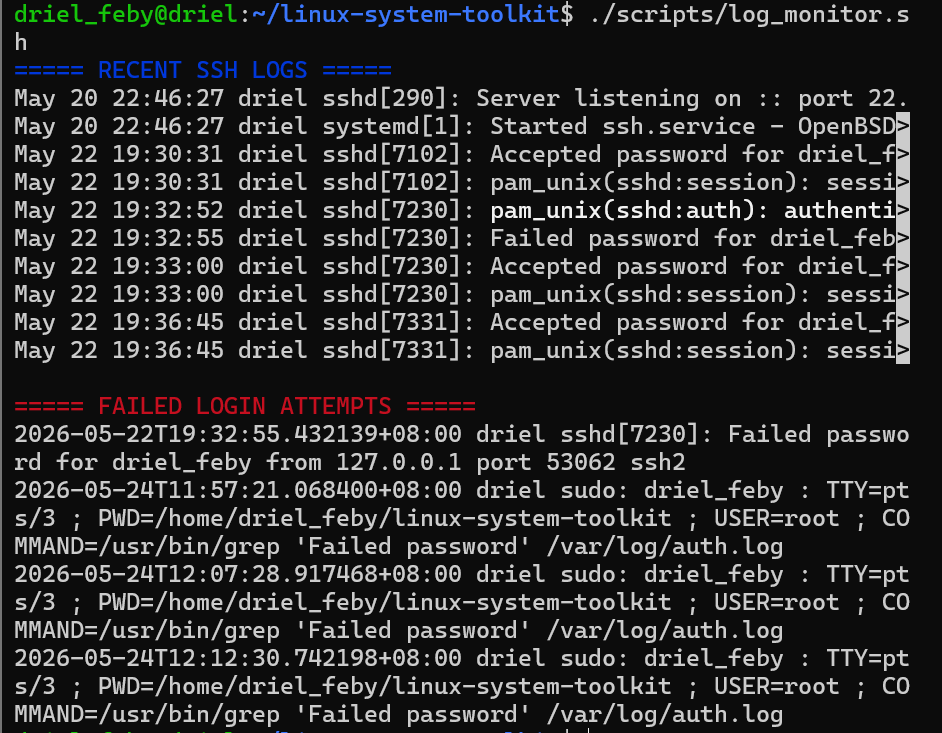

---

# Network Scanning & Security Auditing

## Port Scanning

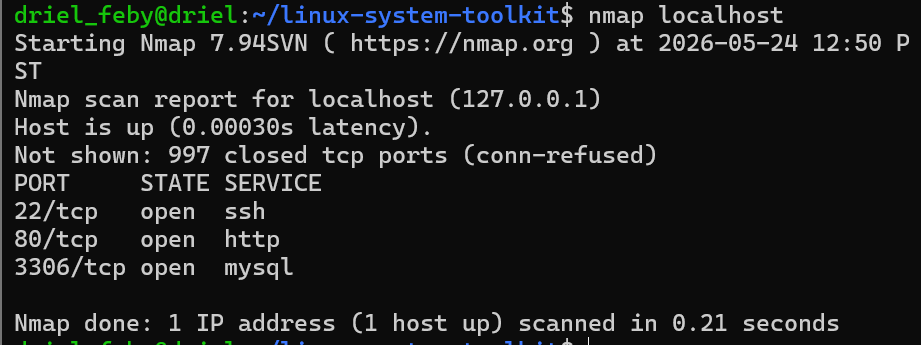

---

## Open Port Detection

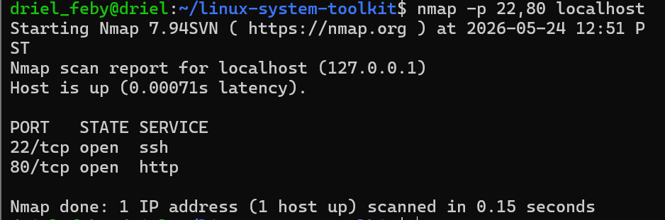

---

## Service Detection

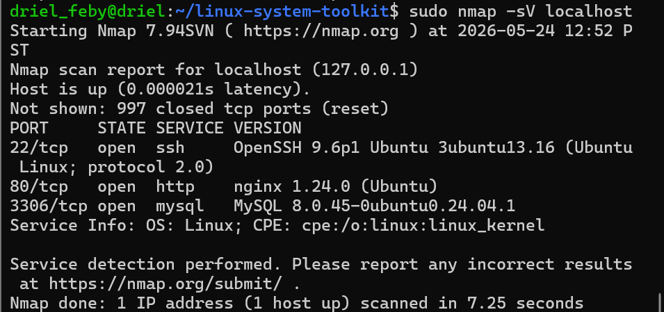

---

## Host Discovery

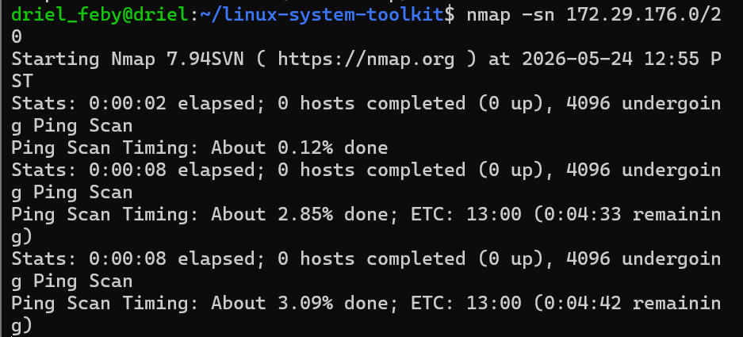

---

## Network Scanner Script

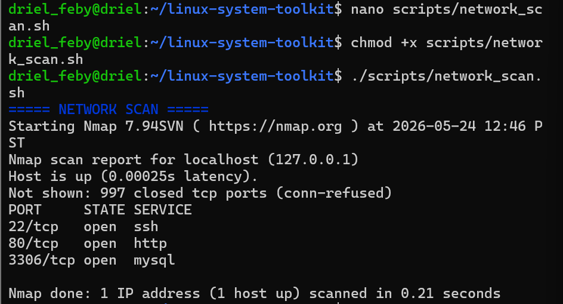

---
## Packet Monitor Script


-------

## Backup Automation

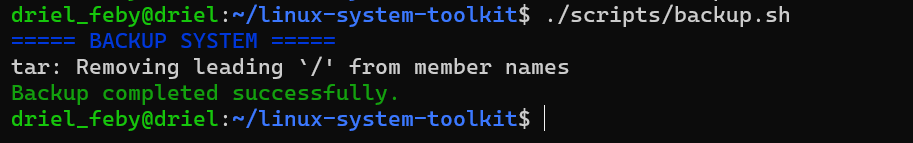

---

## Restore Testing

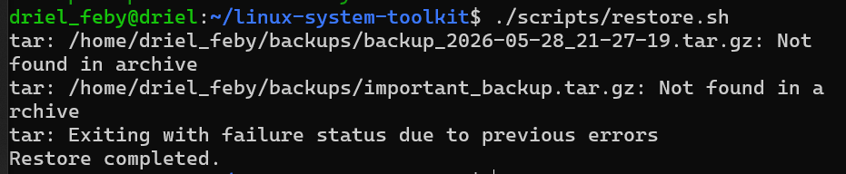

---

# Disaster Recovery Features

- Automated backups
- Restore testing
- Compressed archives
- Scheduled backups
- Recovery workflows
- Backup automation
- Linux administration
- Disaster recovery planning
- Infrastructure protection

# Traffic Monitoring Features

- Packet capture
- Traffic monitoring
- Protocol inspection
- Network troubleshooting
- Packet analysis
- Cybersecurity monitoring

# Security Monitoring Features

- SSH activity monitoring
- Authentication log analysis
- Failed login detection
- Real-time log monitoring
- Linux security auditing
- Troubleshooting workflows

# Security Auditing Features

- Port scanning
- Open service detection
- Host discovery
- Network reconnaissance
- Service version detection
- Linux security auditing
- Network troubleshooting

---

# Security Benefits

- Detects active network services
- Verifies server accessibility
- Helps identify exposed ports
- Assists in security monitoring
- Useful for Linux administration and troubleshooting

---

# Project Goals

This project was built to improve practical skills in:

- Linux Administration
- Bash Scripting
- Networking
- Service Monitoring
- Security Auditing
- Automation
- DevOps Fundamentals

---

# Future Improvements

- Docker monitoring
- Kubernetes checks
- JSON report generation
- Email alerts
- Cron automation
- Web dashboard
- Log analysis system

---

# Author

Created by driel16
