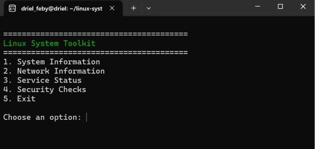
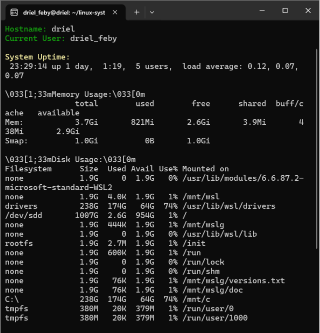
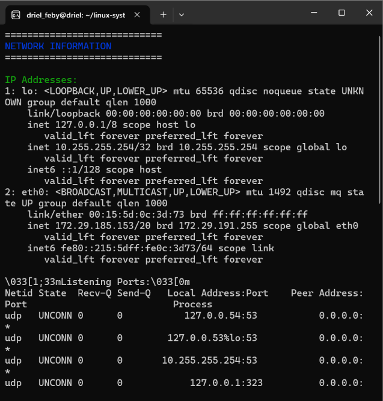
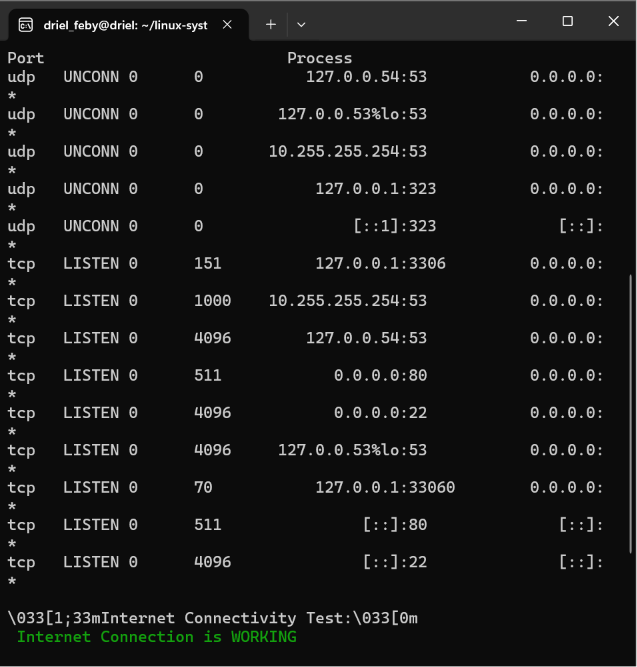
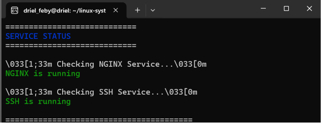
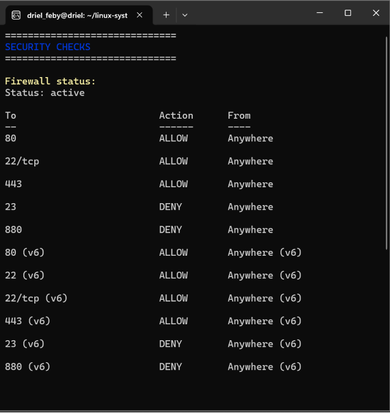
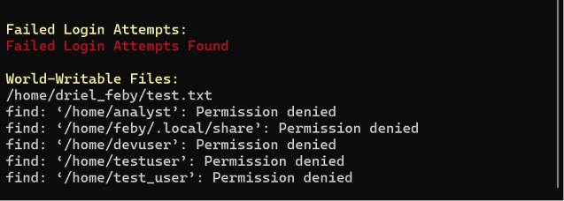

# Linux System Toolkit

A professional Bash-based Linux administration and networking toolkit designed for system monitoring, service management, security auditing, and troubleshooting.

---

# Features

- System information monitoring
- Memory and disk usage analysis
- Network diagnostics
- Open port detection
- Internet connectivity testing
- NGINX service monitoring
- SSH service checks
- Firewall status monitoring
- Failed login detection
- World-writable file detection
- Interactive terminal menu
- Colored terminal output
- Log generation support

---

# Technologies Used

- Bash Scripting
- Linux
- Networking Tools
- Systemd
- Git & GitHub

---

# Project Structure

```bash
linux-system-toolkit/
├── toolkit.sh
├── scripts/
│   ├── system_info.sh
│   ├── network_info.sh
│   ├── service_check.sh
│   └── security_check.sh
├── logs/
└── README.md
```

---

# Installation

Clone the repository:

```bash
git clone https://github.com/YOUR_USERNAME/linux-system-toolkit.git
```

Go into project directory:

```bash
cd linux-system-toolkit
```

Make scripts executable:

```bash
chmod +x toolkit.sh
chmod +x scripts/*.sh
```

Run the toolkit:

```bash
./toolkit.sh
```

---

# Usage Example

## Main Menu

```text
==============================
 Linux System Toolkit
==============================

1. System Information
2. Network Information
3. Service Status
4. Security Checks
5. Exit
```

---

# Screenshots

## Main Menu



## System Information



## Network Information




## Service Status



## Security Checks



---

# Project Goals

This project was built to improve practical skills in:

- Linux Administration
- Bash Scripting
- Networking
- Service Monitoring
- Security Auditing
- Automation
- DevOps Fundamentals

---

# Future Improvements

- Docker monitoring
- Kubernetes checks
- JSON report generation
- Email alerts
- Cron automation
- Web dashboard
- Log analysis system

---

# Author

Created by driel16
