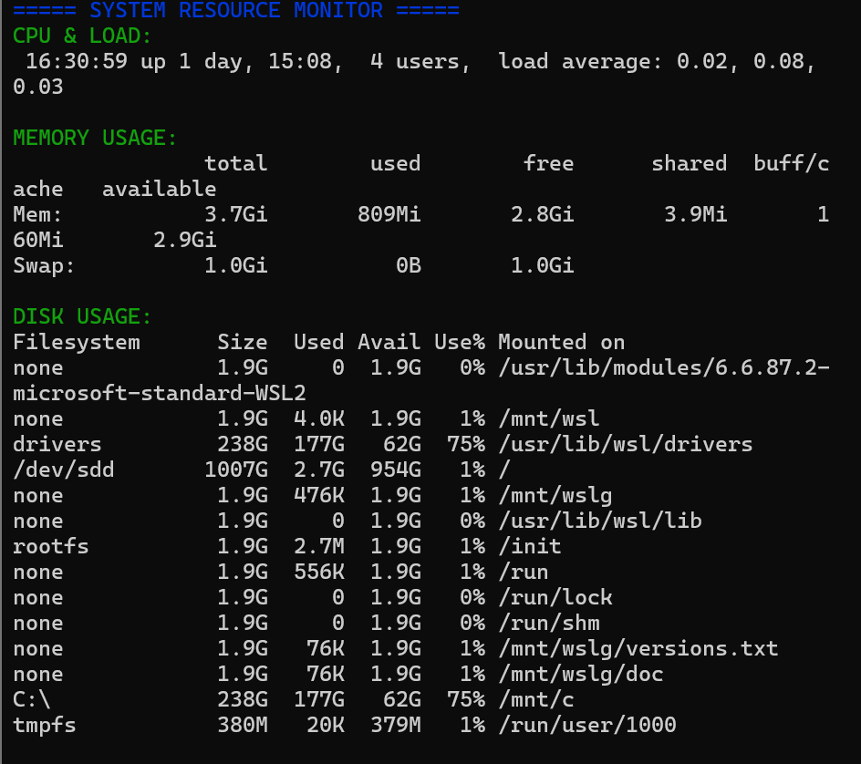
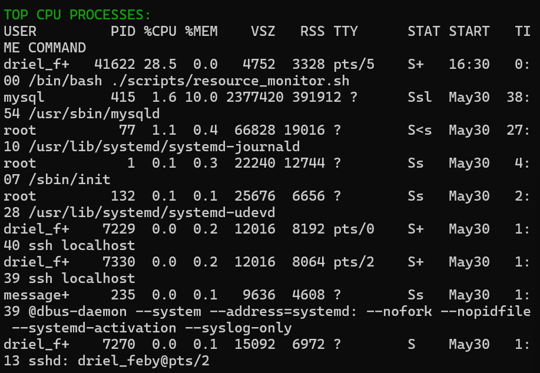
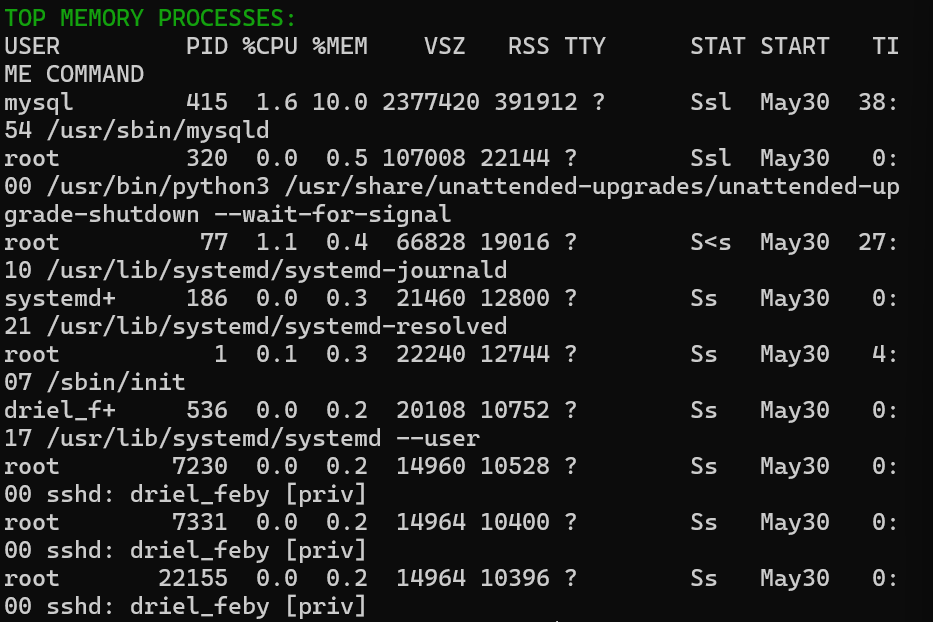
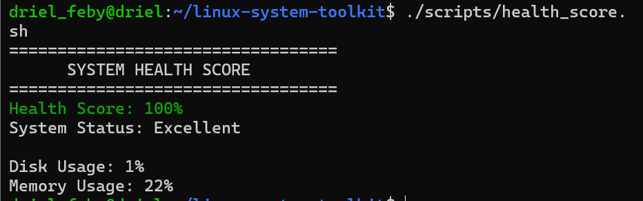

# Linux System Toolkit

A professional Bash-based Linux administration, networking, security auditing, and system monitoring toolkit designed to automate common system administration tasks. This project demonstrates practical Linux administration, Bash scripting, networking, security monitoring, log management, backup automation, and infrastructure monitoring skills.

---

# Project Overview

The Linux System Toolkit is a collection of Bash scripts that provide administrators with tools for monitoring system health, analyzing network configurations, auditing security settings, managing services, generating system reports, and performing backup and recovery operations.

The project was developed as a hands-on learning experience to strengthen Linux administration, networking, automation, and cybersecurity skills through real-world system management tasks.

---

# Key Features

### System Administration

* System information monitoring
* Memory and disk usage analysis
* Process monitoring
* Resource auditing
* System health scoring
* Automated system reporting

### Networking

* Network diagnostics
* IP address discovery
* Internet connectivity testing
* Open port detection
* SSH port verification
* NGINX port verification
* Nmap host discovery
* Nmap port scanning
* Packet capture and traffic monitoring

### Security Monitoring

* Authentication log analysis
* Failed login detection
* SSH activity monitoring
* Security auditing
* World-writable file detection
* Firewall status monitoring
* Service security checks

### Service Management

* NGINX service monitoring
* SSH service monitoring
* Running service verification
* Service status reporting

### Log Management

* Log monitoring
* Log analysis
* Log archiving
* Log storage management
* Security log review

### Backup & Recovery

* Automated backups
* Restore testing
* Compressed backup archives
* Disaster recovery preparation
* Backup validation

### Reporting & Automation

* System report generation
* Resource monitoring reports
* Health score calculation
* Cron job automation
* Infrastructure reporting

---

# Technologies Used

* Bash Scripting
* Linux (Ubuntu)
* Git & GitHub
* Nmap
* tcpdump
* OpenSSH
* NGINX
* UFW Firewall
* Cron Scheduler
* Linux System Utilities

---

# Project Architecture

```text
Linux System Toolkit
│
├── System Information
├── Network Information
├── Service Monitoring
├── Security Auditing
├── Resource Monitoring
├── Log Management
├── Backup & Recovery
├── Health Dashboard
├── Health Score Calculator
├── Report Generator
└── Network Scanning
```

---

# Project Structure

```text
linux-system-toolkit/
├── toolkit.sh
├── scripts/
│   ├── system_info.sh
│   ├── network_info.sh
│   ├── service_check.sh
│   ├── security_check.sh
│   ├── resource_monitor.sh
│   ├── log_manager.sh
│   ├── backup.sh
│   ├── restore.sh
│   ├── generate_report.sh
│   ├── health_score.sh
│   └── health_dashboard.sh
├── logs/
├── reports/
├── screenshots/
└── README.md
```

---

# Installation

Clone the repository:

```bash
git clone https://github.com/driel16/linux-system-toolkit.git
```

Navigate to the project directory:

```bash
cd linux-system-toolkit
```

Make all scripts executable:

```bash
chmod +x toolkit.sh
chmod +x scripts/*.sh
```

Run the toolkit:

```bash
./toolkit.sh
```

---

# Screenshots

## Main Menu


---

## System Information


---

## Network Information


---

## Service Monitoring


---

## Security Monitoring


---

## Resource Monitoring







---

## Log Management


---

## System Health Dashboard


---

## Health Score Calculator



---

## System Report Generator


---

# Skills Demonstrated

### Linux Administration

* Process management
* User and permission management
* Service administration
* Log analysis
* Backup and recovery

### Networking

* TCP/IP fundamentals
* Network diagnostics
* Port scanning
* Service verification
* Traffic monitoring

### Cybersecurity

* Security auditing
* Authentication monitoring
* Failed login detection
* Firewall management
* Security log analysis

### Automation

* Bash scripting
* Cron scheduling
* Automated reporting
* Health monitoring
* Backup automation

### Version Control

* Git
* GitHub
* Documentation management

---

# Project Goals

This project was built to strengthen practical skills in:

* Linux Administration
* Bash Scripting
* Networking
* Security Auditing
* Infrastructure Monitoring
* Automation
* DevOps Fundamentals
* System Troubleshooting

---

# Future Improvements

* Docker monitoring
* Container health checks
* Kubernetes integration
* Grafana dashboards
* Prometheus monitoring
* Email alerting system
* Web-based dashboard
* Advanced log analysis
* SIEM integration

---

# Author

Feby Driel Igbalic

Bachelor of Science in Computer Science Major in Cyber Security

GitHub: https://github.com/driel16
